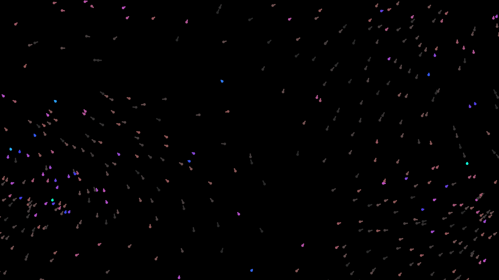
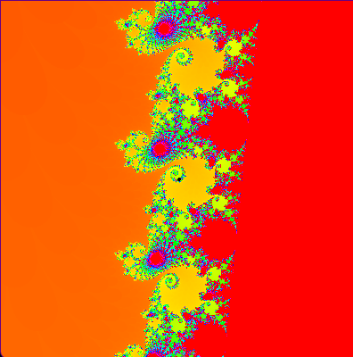
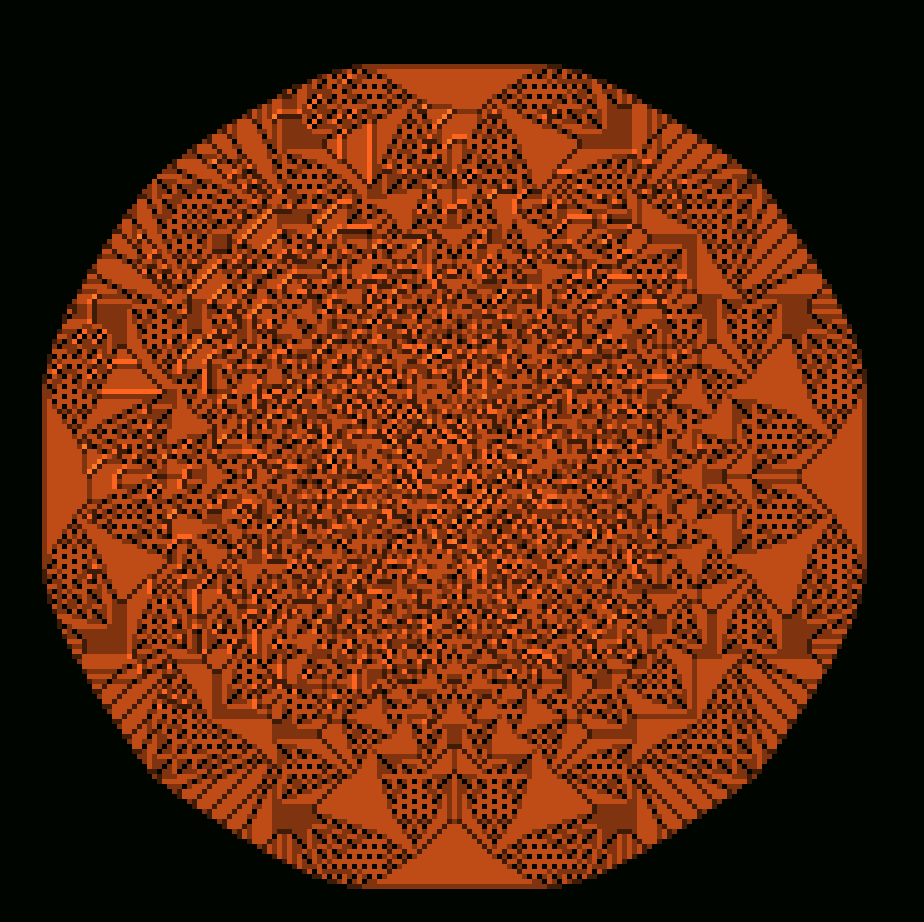
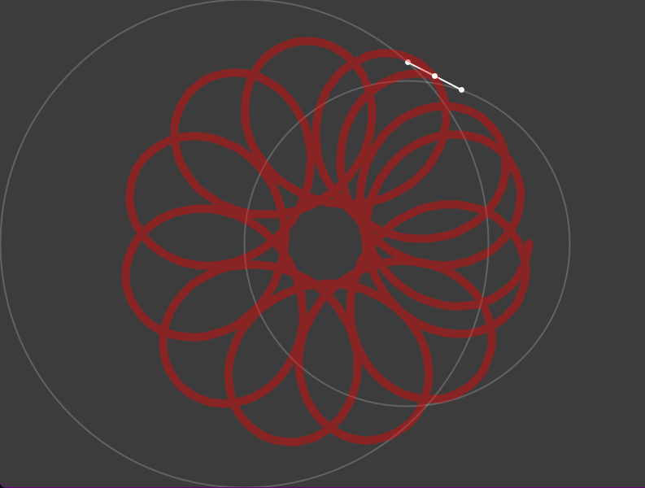

# Processing Sketches

<div style="width: max-content; margin: auto;">
	
</div>

A collection of original Processing sketches i made

## Get started with Processing:

-   Home Page: https://processing.org/
-   Reference: https://processing.org/reference
-   DOwnload Processing from [here](https://processing.org/download), then clone the repo to run the sketches:

```bash
git clone https://github.com/ZOASR/processing-sketches.git
```

<div style="width: 100%; margin: auto; display: flex; flex-direction: column; gap: 2em;">
	
	
	
	
</div>
